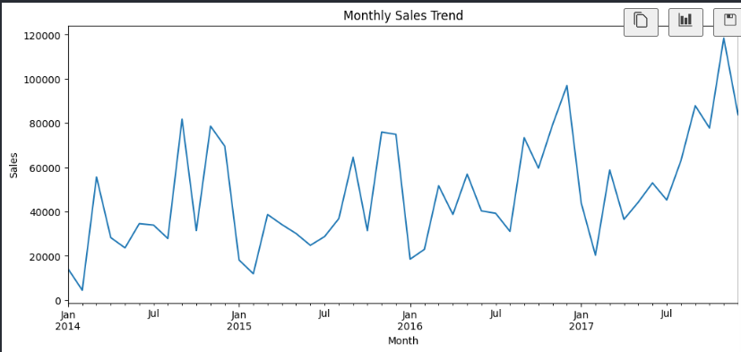
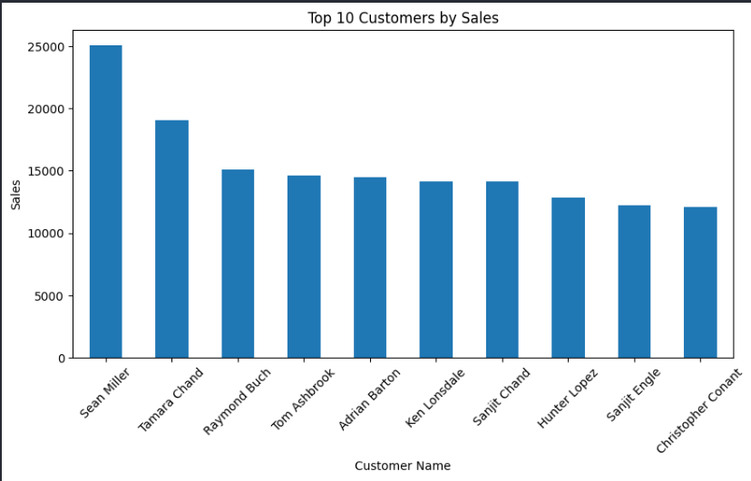
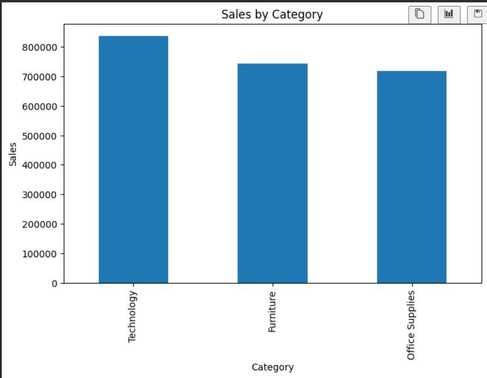
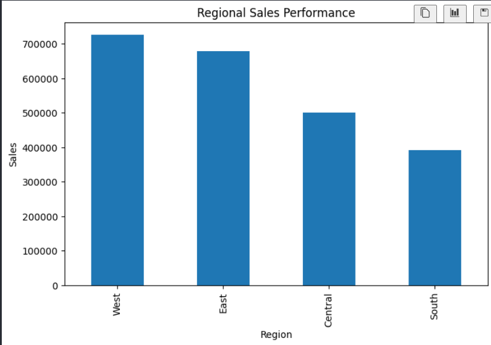
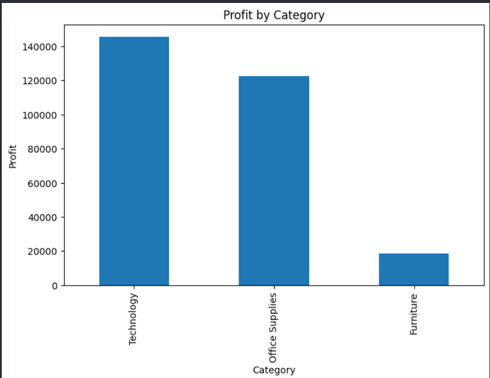
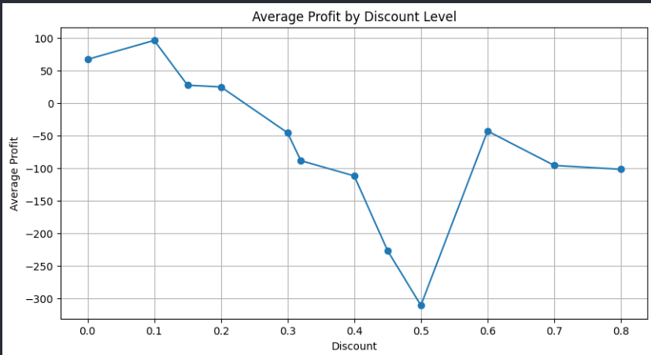

# End-to-End E-Commerce Analytics Project

## Project Overview

This project analyzes retail sales data to uncover customer behavior, sales trends, profitability drivers, and business insights using Python, Pandas, Matplotlib, Seaborn, and Power BI.

## Objectives

* Analyze sales and profit performance.
* Identify top customers and high-performing product categories.
* Evaluate regional sales trends.
* Measure the impact of discounts on profitability.
* Generate actionable business insights through data analysis and visualization.

## Dataset Information

* Total Records: 9,994
* Total Columns: 21
* Total Orders: 5,009
* Total Customers: 793

## Tools & Technologies

* Python
* Pandas
* NumPy
* Matplotlib
* Seaborn
* Power BI
* Git
* GitHub

## Data Cleaning

* Checked and verified missing values.
* Checked for duplicate records.
* Converted Order Date and Ship Date to datetime format.
* Validated data consistency and structure.

## Business KPIs

Total Sales- $2,297,200.86 
Total Profit- $286,397.02   
Total Orders- 5,009         
Total Customers- 793           

## Exploratory Data Analysis

### Monthly Sales Trend

### Top Customers Analysis

### Category Analysis

### Regional Analysis

### Profitability Analysis

### Discount Impact Analysis

## Key Business Insights

* Generated over $2.29M in total sales.
* Achieved total profit exceeding $286K.
* Sales demonstrated a strong upward trend from 2014 to 2017.
* Certain regions contributed significantly more revenue than others.
* High discount levels negatively impacted profitability.
* A small group of customers contributed a substantial share of total revenue.
* Product category performance varied significantly across the business.

## Power BI Dashboard

The dashboard includes:
1. Executive Overview
2. Sales Performance Analysis
3. Customer Analytics
4. Regional Analysis
5. Profitability Analysis

## Skills Demonstrated

* Data Cleaning
* Exploratory Data Analysis (EDA)
* Business Intelligence
* Data Visualization
* KPI Reporting
* Customer Analytics
* Sales Analytics
* Profitability Analysis
* Python Programming
* Power BI Dashboard Development
